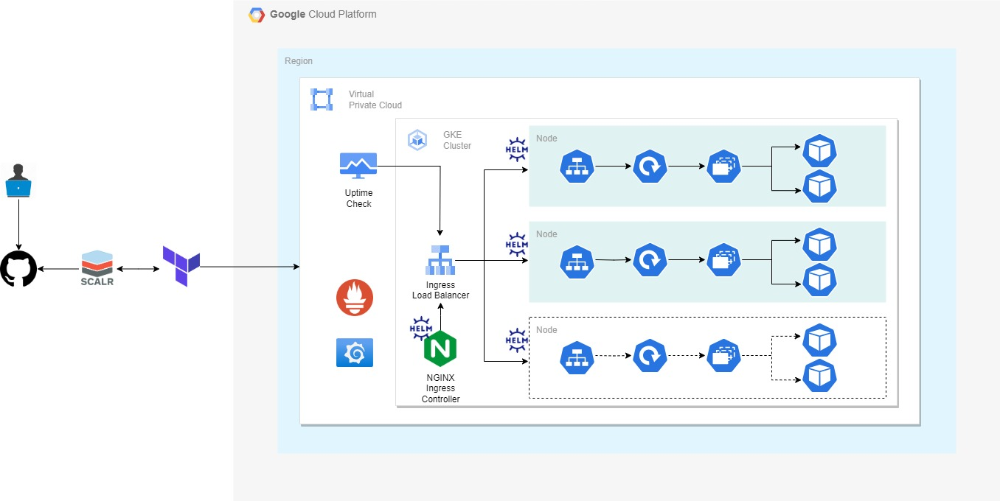
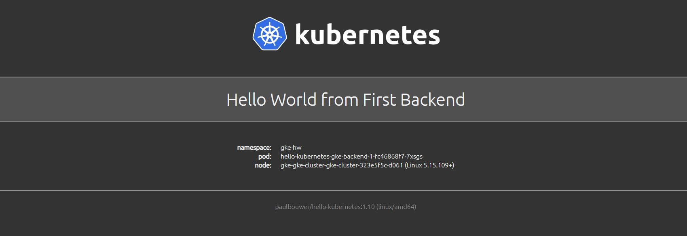

# Kubernetes & HELM in GCP with Terraform.

Terraform template to provision the follow resources:

1. Google Virtual Private Cloud (VPC).
2. Google Subnetwork.
3. Google Kubernetes Engine (GKE) Cluster.
4. Kubernetes Ingress v1.
5. Public Helm Chart "Hello World".
6. Public Helm Chart "Nginx Ingress Controller".
7. Google Uptime Checks.

## Summary

The template create a VPC and a Subnetwork, then it creates a Regional or Zonal GKE Cluster, removes the "default node". After this, it provisions a node pool associated with the cluster and creates the number of nodes you specify in `gke_nodes` variable.

Once the GCP resources are created, Terraform will use the Kubernetes and Helm providers to connect to the cluster to deploy  the public chart for "Hello World on Kubernetes" by [Paul Bouwer](https://github.com/paulbouwer/hello-kubernetes) as well as the official NGINX Ingress Controller Chart from the [Nginx repo](https://kubernetes.github.io/ingress-nginx).
Also, with Terraform Kubernetes provider, will deploy an Ingress_v1 resource top manage the Ingress independantly.

After deploying Helm resources, the template will provision a HTTP Google Uptime Check on paths defined for the Ingress Backends.

When succesfully applied the Terraform code, an output will be showing, please add the value of the output to your terminal to add the cluster to your Kubeconfig Contexts and use Kubectl CLI.

## Architecture.

## Important keys before applying.

- Not a completely free infrastructure in GCP, so after testing it's recommended to destroy the resources.
- For testing & research purposes only. Not a solution to be deployed in Prod environments.
- For GCS Remote Backend, please have an exisiting GCS Bucket and access to it.

## Prerequisites

### Software

- **Mandatory** Install [Terraform](https://developer.hashicorp.com/terraform/tutorials/aws-get-started/install-cli)
- **Mandatory** Install [Gcloud cli](https://cloud.google.com/sdk/docs/install-sdk)
- **Mandatory** Install [Gcloud Auth](https://cloud.google.com/blog/products/containers-kubernetes/kubectl-auth-changes-in-gke#:~:text=Install%20using%20%22gcloud%20components%20install%22)
- **Mandatory** Install [Kubectl](https://kubernetes.io/docs/tasks/tools/)
- **Optional** Install [HELM](https://helm.sh/docs/intro/install/)

### Resources

- **Mandatory** A [GCP Account](https://cloud.google.com).
- **Mandatory** An [IAM Service Account](https://cloud.google.com/iam/docs/service-accounts-create) with proper permissions to deploy the GCP infrastructure.
- **Optional** A GCS Bucket to store the [TFSTATE](https://developer.hashicorp.com/terraform/language/settings/backends/gcs). Mandatory if you won't deploy the infrastructure using SCALR or Terraform Cloud.
- **Optional** A [SCALR](https://www.scalr.com) Account to remote provisioning and state control.

## How to apply

### Locally

If you would like to apply the code locally, there are some important keys to consider.
You'll need the GCP Service Account keys JSON file and use them to reach the Backend and the GCP console.

Then, you will be able to run Terraform CLI commnads:
- `terraform init` To Initialize the Modules and connect to the GCS Backend Bucket.
- `terraform plan -var-file my-variables.tfvars` to see the the output of your infrastructure to be provisioned with the paramenters set on your .tfvars file.
- `terraform apply -var-file my-variables.tfvars` to apply the desired infrastructure. You will be prompted to enter `yes` to confirm the apply. You can also use `--auto-approve` flag if you are sure to apply the code.
- `terraform destroy -var-file my-variables.tfvars` to destroy the infrastructure.

### Scalr

After creating a SCALR account, please refer to SCALR documentation to connect your repo and setup your remote account.

## Usage

As said, the template will provision a VPC, GKE Cluster, Helm Charts, Ingress and Uptime Checks, all of this resources have to be managed using `dev.tfvars` file. Please do not modify anything inside `modules` and `main.tf` unless you have to do major maintenance to the code.

You will find the proper variables to deploy and modify your resources as needed in your GCP Project.

### Main

`region` and `zone` Variables define the location to deploy your GKE Cluster, whether deploying a resource on a specific Region or Zone, you have to clearly understand these concepts because it depends where you deploy your Cluster and Nodes, the HA and Costs related to it.

### VPC

In here, the key variable is `ip_cid_block` variable, youdefine the CIDR Block network to your subnet or subnets, in this case we just deploy one in the Region defined.

### GKE

The GKE resources will manage a Cluster and Node Pool resources as mentioned before. Key to manage you cluster are 4 important settings, which are `location`, `gke_nodes` and `node_locations`.

`location` specify where to place the Master clusters. It can be Region or Zone. This will define the HA and costs.

If `Regional` variable set to `true`, the cluster will be created Regional, with nodes across all of the zones within the `node_locations` specified. So if you set 3 zones in `node_locations` and "1" in `gke_nodes`, this means there will be 1 node in each zone, 3 in total, if value is set to "2", then 6 nodes in total and so on. **Since the scope of this template is not for Prod environments if you use this way it can cause Cost increasing as well as probably a free tier account won't have enough quotas to deploy the resources.**

If `Regional` variable is set to `false`, then a Zonal cluster will be deployed depending on your `zone` variable, and you will have to set more than 1 node in `gke_nodes`, but all will be deployed in the same zone, which is covered by the GCP Free Tier.

`inital_node_count` since we are using `google_container_node_pool` objects with no default node pool, you'll need to set this to a value of at least 1, alongside setting remove_default_node_pool to true.

### HELM

#### HELM Releases
There is a directory called `hello-kuberntes` from the public repository we use, inside you will find the Manifests for the Deployments, Services and the Parameters to be managed with Terraform.

For HELM Charts we only create a single resource `helm_release` form HELM provider. This will deploy the HELM releases stated in the `releases` variable, which is a Map. THe resource uses a for_each to apply all for the variable and this way we can manage each release separately of each other with no need of modifying an index count in the Terraform State, the Key Values that are specified within the Key will function as the HELM Parameters for the HELM Chart and being passed using the `set` block in the resource.

In case of needing more helm releases just add a new key within the `releases` map variable but remember Keys should be unique. 

#### NGINX Ingress Controller

We make use of the official NGINX Ingress Controller, it is deployed in it's own namespace you specify in the `ingress_controller_variable`

#### Ingress v1

With the problem of not knowing how many Services backends we need at the end of the day we have to automate the way to add/remove backends to/from our Ingress resource, so the approach is to create the Ingress using Kubernetes Provider and setup the same way we would do it using a YAML manifest but in here we have a Dynamic block at `Path` level, which allows us to iterate the variables when a new HELM Release is added or removed.

### Uptime Checks 

Terraform will create a HTTP 2XX Check for any Key you will define in `uptime_config` variable map.

The `path` value should be the same as stated for your new backend created in HELM Releases.

## Connecting to the cluster

After creating the cluster, if you want to use Kubectl you will have to add your cluster to the Kubeconfig Context, For this you will only have to add the command that results at the end of you apply if succesfully created.

## Testing the solution

After all resources are deployed and we are connected to our cluster, we can test our Kubernetes resources.

Run `kubectl get ingress -n gke-hw` to get the ingress resources.
Run `kubectl describe ingress ingress-nginx -n gke-hw` to display a description of your Ingress.

You will see the Public IP Adress and under rules you will see the Paths as you named in your configuration as "/my_path".

Copy the IP and any path into your browser as http://my_ip/my_path and you will see the follow page:

In this frontend we have the custom value of `message` variable we define in HELM Releases. It also shows the Kubernetes Namespace, Pod and Node the HELM chart is in.
Refresh constantly to see the redirection of the number of Pods and Nodes.

### Contributors

---

Hiram Rosales - Cloud Engineer

